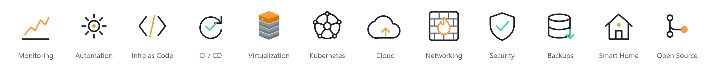
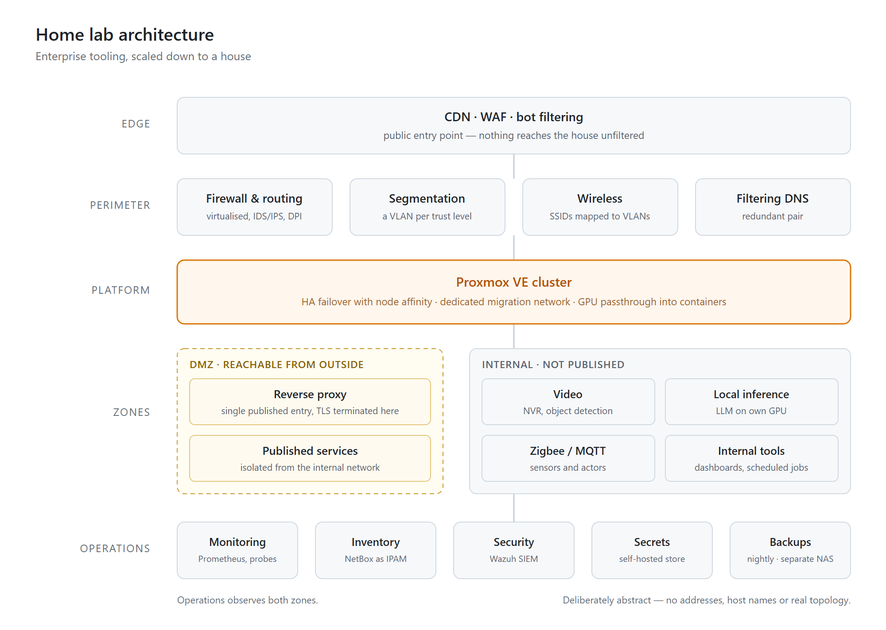

## Marvin Z

<picture>
  <source media="(prefers-color-scheme: dark)" srcset="github-header-dark.png">
  
</picture>

Home lab enthusiast who turned the hobby into a career. I was running servers at
home long before anyone paid me for it; today I'm a systems administrator with a
decade of site reliability engineering and IT security behind me — and the lab is
still where I try things first.

Infrastructure automation, monitoring, and making things observable — at work and
at home. Same tools, same standards, smaller blast radius.

I prefer open source wherever it does the job, and I try to give back rather than
just consume: fixes and features go upstream instead of living in a private fork,
and I sponsor projects I rely on.

I maintain the **[Proxmox VE integration for Home Assistant](https://github.com/dougiteixeira/proxmoxve)**.
New features are developed and tested in [my fork](https://github.com/mZ738/proxmoxve-integration)
before they go upstream — that repo is the beta channel if you want to try them early.

### Skills

| | |
|---|---|
| **Currently** | SAP Basis (HANA, S/4HANA, ERP) · Prometheus · Grafana · Microsoft SQL Server · PowerShell · Python · Bash |
| **Home lab** | Proxmox VE · Home Assistant · Wazuh · NetBox · GitLab CI · OpenTofu · Zigbee / MQTT · Frigate · firewall with IDS/IPS · encrypted filtering DNS |
| **Also experienced with** | Kubernetes · Google Kubernetes Engine · Terraform · Google Cloud Platform · CI/CD · SRE practices · information security · vulnerability management |

### The home lab

<picture>
  <source media="(prefers-color-scheme: dark)" srcset="homelab-dark.png">
  
</picture>

A multi-node Proxmox VE cluster with HA failover, a virtualised firewall routing a
segmented VLAN network, and Home Assistant tying the house together.

Enterprise tooling, scaled down to a house:

- **Wazuh** as a SIEM, with agents reporting from the hosts
- **NetBox** as IPAM and inventory, feeding Prometheus service discovery automatically
- **Elasticsearch** behind the firewall's deep packet inspection reporting
- **A self-hosted secret store**, so no credentials sit in config files
- **Self-hosted GitLab with CI on every push** — documentation, playbooks and infrastructure code for the lab live in one repository; pipelines lint, validate and secret-scan before anything merges
- **Infrastructure as code** — the DNS cluster is managed with OpenTofu, existing state imported rather than rebuilt
- **Cluster HA failover** with node affinity rules, over a dedicated migration network
- **GPUs passed through into containers** for camera object detection and local LLM inference
- **Encrypted, redundant DNS** — DoT/DoH/DoQ with failover VIPs, so name resolution survives a node going down

Most of what I publish here started as something I needed there first.
